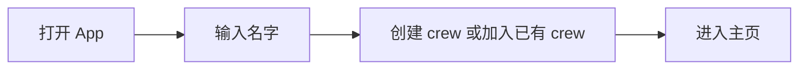
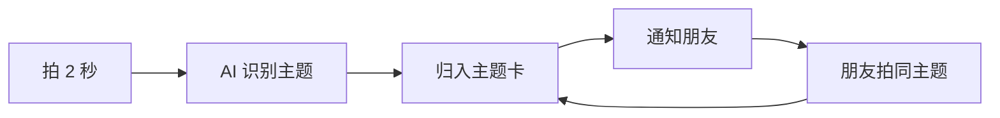
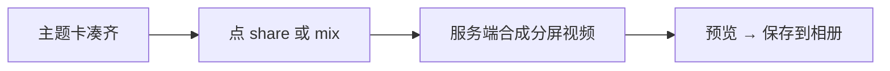
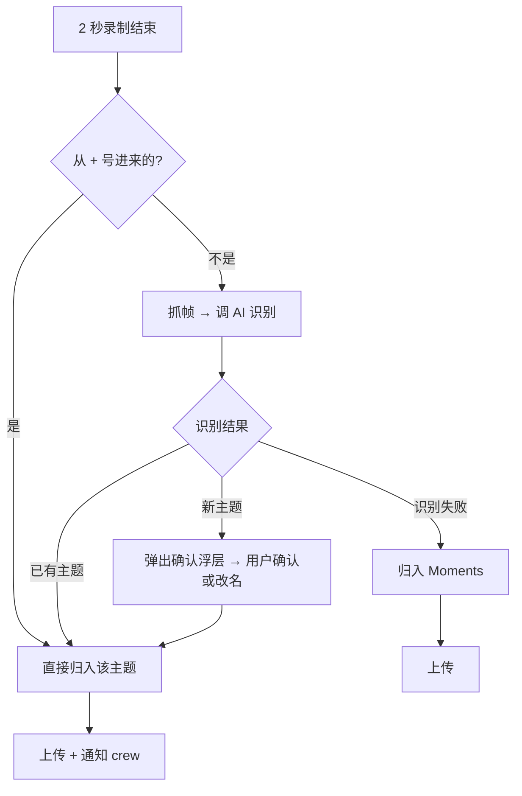
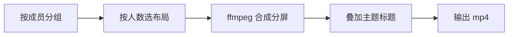

# Amingo — 开发 PRD

> 和朋友各拍同一个主题的 2 秒视频，AI 自动拼成分屏成片——不同的人，不同的地方，同一件事。

---

## 1. 背景：这个产品解决什么问题

异地密友想拍"合照/合拍"，但做不到——不在同一个地方。

现有方案都不行：

- **iMessage / 微信发照片**：拍完发给朋友，沉进聊天记录，没有"作品感"，不会变成可以分享到社媒的内容。
- **CapCut / 剪映手动拼**：能做出分屏视频，但操作极重——导入素材、对齐时间轴、调布局、导出，至少 12 步。
- **BeReal / Locket**：解决了"异地同一时刻"，但拍完各看各的，没有"拼在一起"的合拍感。

社媒上 #longdistancebesties 等趋势说明人们已经在做异地同主题拍摄，但因为流程太痛苦，只在生日、毕业才做。日常想拍的冲动，被操作成本杀死了。

**Amingo 做的事只有一件：把 12 步变成 1 步。**

你拍 2 秒 → AI 自动识别主题 → 自动通知朋友 → 朋友也拍 2 秒 → 自动拼成分屏成片 → 可以直接发社媒。

### 产品灵魂

- **"我拍了，你也来"** —— 不是工具，是一个邀请
- **同频感** —— 同一个主题、不同的人、不同的地方，放一起就是"我们有多同频"的证据
- **零压力** —— 不打卡、不限时、不催。你想拍就拍，产品只管拼

### 目标用户

- 18-25 岁，有 2-5 个异地密友的大学生 / 刚毕业年轻人
- 高中好友各奔东西、异地闺蜜/兄弟、跨城情侣
- 美国市场优先，Web App（手机浏览器）

---

## 2. 用户故事

### 故事一：异地闺蜜的日常合拍

**Before：** Mia 在纽约拍了一杯拿铁，想发个"和闺蜜隔着太平洋一起喝咖啡"的 IG story。她把照片发给东京的 Sara，说"你也拍一杯"。Sara 三小时后看到，拍了奶茶发回来。Mia 打开剪映，导入、调分屏、对齐、加字幕、导出——折腾了 15 分钟，算了不发了。

**After：** Mia 打开 Amingo，拍了 2 秒拿铁。AI 识别为 "Drink"。Sara 收到 "Mia filmed Drink — wants to see yours!"，打开 app，看到 Mia 的拿铁 + 自己的空位，点 + 拍了 2 秒奶茶。两杯饮料自动上下分屏，长按分享到 IG story。全程不到 30 秒。

### 故事二：四个室友各奔东西

**Before：** 四人毕业后散在四个城市。想拍"四个人在不同城市吃早餐"发 TikTok，光是催"大家都拍了发给我"就要三天，最后凑不齐。

**After：** Alex 早上吃煎饼随手拍了 2 秒，AI 识别为 "Food"，其他三人陆续收到提醒，各自拍了自己的早餐。四段视频自动拼成田字格分屏，点 share 导出，直接发 TikTok。没人催谁，没人等谁，没人剪辑。

### 故事三：情侣的周记

**Before：** 异地情侣想记录"我们今天都做了什么"，只能在微信里互发照片。看完就沉进聊天记录，没有回顾感。

**After：** 两人一周随手拍了 Drink、Selfie、Outdoor 三个主题，每个都是上下分屏。周末点 mix all，三个主题串成一条混剪——这一周我们虽然不在一起，但做了同样的事。保存到相册，就是这一周的"合照"。

---

## 3. 用户路径总览

### 3.1 新用户进入



已有 session（localStorage）的用户跳过以上步骤，直接进入主页。

### 3.2 核心循环：拍摄 → 归类 → 通知



### 3.3 导出



---

## 4. 页面结构

整个 app 只有 4 个视图（同一页面内的状态切换，不是页面跳转）：

1. **Onboarding** —— 创建/加入 crew
2. **主页** —— 左右滑动的主题卡片
3. **相机** —— 全屏拍摄 2 秒
4. **成片预览** —— 导出后的视频播放 + 保存

另有两个浮层：

5. **主题确认浮层** —— AI 识别出新主题时弹出，用户可改名
6. **Nudge 横幅** —— 朋友拍了视频时顶部滑出

---

## 5. 各页面详细设计

### 5.1 Onboarding

```
┌─────────────────────────┐
│                         │
│        AMINGO           │
│                         │
│   film 2s clips with    │
│   your crew             │
│   same topic,           │
│   different takes       │
│                         │
│   ┌───────────────┐     │
│   │  your name    │     │
│   └───────────────┘     │
│                         │
│   ┌───────────────┐     │
│   │ START A CREW  │     │
│   └───────────────┘     │
│                         │
└─────────────────────────┘
```

**何时显示**：localStorage 中没有 `amingo_crew` 和 `amingo_member` 时。

**两种入口**：

| 场景 | 副标题 | 按钮文案 | 接口 |
|---|---|---|---|
| 直接打开 app | "film 2s clips with your crew" | START A CREW | POST `/api/crew` |
| 通过邀请链接 /join/:id | "{创建者名字}'s crew" | JOIN CREW | POST `/api/crew/:id/join` |

**localStorage 存储**：`amingo_crew`、`amingo_member`、`amingo_name`

**边界**：
- 同名 join → 视为同一人，返回已有 memberId
- localStorage 存了旧 crewId 但 API 返回 404 → 清 localStorage → 重新进 Onboarding
- 通过 join 链接打开但 localStorage 里存了另一个 crew → 以 join 链接为准

### 5.2 主页

```
┌─────────────────────────┐
│ AMINGO   [mix▶]  invite+│ ← 顶部栏
│                         │
│  Drink            ▶share│ ← 主题名 + 导出按钮
│ ┌─────────────────────┐ │
│ │ Mia 的视频          │ │ ← 第一行：拍过的显示视频
│ │              you  2h│ │
│ ├─────────────────────┤ │
│ │ Sara 的视频         │ │ ← 第二行
│ │           Sara  now │ │
│ ├┄┄┄┄┄┄┄┄┄┄┄┄┄┄┄┄┄┄┄┤ │
│ │        + Alex       │ │ ← 第三行：没拍的显示 +
│ │     (虚线边框)       │ │
│ └─────────────────────┘ │
│                         │
│        ● ○ ○ ○          │ ← 圆点指示器
│         (●)             │ ← 绿色拍摄按钮
└─────────────────────────┘
```

**卡片排列顺序**（从左到右）：

1. 有空位的主题卡（有成员还没拍的），按最新 clip 时间倒序
2. 已完成的主题卡（所有成员都拍了），按最新 clip 时间倒序
3. Moments 卡（如果有无主题的 clip）
4. "film something new" 卡（永远在最右）

**每个成员的视频行有 3 种状态**：

| 状态 | 显示 |
|---|---|
| 拍了 1 条 | 整行显示视频（循环播放），左下角名字（自己显示 "you"），右下角时间 |
| 拍了多条 | 该行横向分成多格（每格一条），最右格是 + 可继续拍 |
| 没拍 - 自己 | 整行可点击的 + 号，点击进入相机拍该主题 |
| 没拍 - 别人 | 整行灰色，居中显示该成员名字（低透明度） |

**顶部栏按钮**：

| 按钮 | 行为 |
|---|---|
| mix ▶ | 导出混剪成片（只含 2+ 人拍过的主题） |
| invite + | 复制邀请链接到剪贴板 |

**数据刷新**：每 4 秒轮询 GET `/api/crew/:crewId`，同时检查新 nudge。

### 5.3 相机

```
┌─────────────────────────┐
│ (✕)              (🔄)   │ ← 关闭 / 翻转摄像头
│                         │
│                         │
│       Drink             │ ← 幽灵文字（仅从+号进入时有）
│    (12%透明度,3.5s消失)   │
│                         │
│                         │
│                         │
│ ┌───┐                   │
│ │📂 │    (  ●  )        │ ← 相册上传 / 快门按钮
│ └───┘                   │
│     tap to film 2s      │
└─────────────────────────┘
```

**两种入口的差异**：

| 入口 | 幽灵文字 | 拍完走向 |
|---|---|---|
| 从主题卡的 + 号进入 | 显示该主题名，3.5 秒淡出 | 直接归入该主题，不走 AI |
| 底部绿色按钮 / film new | 无 | 拍完走 AI 识别 |

**拍摄后的处理流程**：



**其他功能**：
- 翻转摄像头：前置 scaleX(-1) 镜像，后置正常
- 相册上传：`<input type="file" accept="video/*">`，选择后直接进入 processCapture

### 5.4 主题确认浮层

```
┌─────────────────────────┐
│       (半透明黑背景)       │
│                         │
│       ┌────────┐        │
│       │ Drink  │        │ ← AI 推荐的主题名（可编辑）
│       └────────┘        │
│      ─────────────      │ ← 绿色下划线
│    tap name to edit     │
│                         │
│       ┌────────┐        │
│       │   ✓    │        │ ← 确认按钮
│       └────────┘        │
│                         │
└─────────────────────────┘
```

- 新主题时弹出，AI 推荐的名字已填好
- 用户点击主题名可修改
- 必须点击 ✓ 确认（不会自动消失）
- 如果用户改成 "Moments" → 归入无主题

### 5.5 成片预览

- 全屏遮罩层（黑色 92% 透明度）
- 居中 `<video>` 播放器（controls autoplay loop）
- 下方两个按钮："save"（下载 mp4）、"close"

### 5.6 Nudge 横幅

- 有人拍了有主题的视频 → crew 其他人看到顶部滑下横幅
- 内容："Sara filmed Drink — wants to see yours!"
- 4 秒后自动收起
- 点击横幅 → 打开相机
- 不通知自己拍的；归入 Moments 的不通知

---

## 6. 数据模型

### Crew

```json
{
  "id": "a1b2c3d4",
  "members": [
    { "id": "e5f6g7", "name": "Sara" }
  ],
  "clips": [],
  "nudges": []
}
```

- `id`: 8 char hex
- `members[].id`: 6 char hex

### Clip

```json
{
  "id": "h8i9j0",
  "memberId": "e5f6g7",
  "memberName": "Sara",
  "file": "a1b2c3d4_h8i9j0.mp4",
  "thumb": "data:image/jpeg;base64,...",
  "category": "Drink",
  "ts": 1718668800000
}
```

- `category`: AI 识别的主题名（一个英文单词）。null 表示归入 Moments。
- `thumb`: base64 JPEG 缩略图，从视频第一帧抓取。可为 null。
- `file`: 服务端保存的文件名。

### Nudge

```json
{
  "from": "Sara",
  "category": "Drink",
  "ts": 1718668800000
}
```

### 持久化

- 数据：`crews.json` 文件（JSON 读写磁盘）
- 视频文件：`uploads/` 目录
- Railway 部署时挂载 Volume 到 `/data`，数据 + 文件都存 Volume

---

## 7. AI 主题识别

### 调用方式

- 模型：Claude Haiku 4.5（`claude-haiku-4-5-20251001`）
- 输入：视频第一帧的 base64 JPEG
- 输出：一个英文单词（宽泛的日常主题）

### Prompt

```
Look at this image and return ONLY ONE English word: the broadest everyday category it fits. Think lifestyle theme, not specific object. For example: Food, Drink, Selfie, Outdoor, Pet, Fitness, Music, Work, Travel, Cozy. Prefer broad over narrow. Just one word, nothing else.
```

### 关键规则

- 只返回一个词，不要两个词（如不要 "Daily Working"，应该是 "Work"）
- 不限于固定词表，AI 自由读图，但要尽量宽泛
- 识别失败 / 超时 / 返回空 → 归入 Moments（category = null）

### 接口

```
POST /api/vision
Body: { "image": "data:image/jpeg;base64,..." }
Response: { "label": "Drink" }  // 或 { "label": "" } 表示识别失败
```

---

## 8. 成片合成逻辑

### 单主题成片

触发：点主题卡右上角 ▶ share → `POST /api/crew/:crewId/export` body: `{category: "Drink"}`



布局规格：

| 人数 | 布局 | ffmpeg |
|---|---|---|
| 1 | 全屏 | scale+crop 到 1080x1920 |
| 2 | 上下二分屏 | 各 1080x960，vstack |
| 3 | 上中下三分屏 | 各 1080x640，vstack inputs=3 |
| 4 | 田字格 2x2 | 各 540x960，hstack x2 + vstack |
| 5+ | 上下等分 | 各 1080x(1920/N)，vstack inputs=N |

同一人在同主题下拍了多条 → 该人的行横向分成多格（hstack），再和其他成员的行 vstack。

标题叠加：Python PIL 生成 1080x120 半透明 PNG（黑底 + 白字），ffmpeg overlay 到视频底部。

### 混剪（Mix All）

触发：顶部栏 "mix ▶" 按钮 → `POST /api/crew/:crewId/export` body: `{}`

规则：
- 只有 **2 人及以上**拍过的主题才出现在混剪中（1 人的跳过）
- Moments（无主题）的 clip 也包含，每条全屏显示
- 所有段按时间顺序拼接（ffmpeg concat demuxer）
- 没有任何合格主题 + 没有 Moments → 返回错误

### 视频规格

- 输入：webm（MediaRecorder 输出）或 mp4（上传的文件）
- 处理：统一转 mp4（libx264, yuv420p, aac）
- 输出：1080x1920, 30fps, mp4
- 时长：每条 clip 最长 2 秒，超过截断

---

## 9. 周维度归档

- 以周为单位，每周日归档本周内容
- 新一周从空白开始
- 归档数据不删除，可通过历史入口回看（P2）

MVP 实现：前端按 `ts` 过滤只显示最近 7 天的 clips，真正的归档逻辑后做。

---

## 10. 部署

### Docker

```dockerfile
FROM node:24-slim
RUN apt-get update && apt-get install -y ffmpeg python3 python3-pip && rm -rf /var/lib/apt/lists/*
RUN pip3 install Pillow --break-system-packages
WORKDIR /app
COPY package*.json ./
RUN npm install --production
COPY . .
RUN mkdir -p uploads
EXPOSE 3456
ENV PORT=3456
CMD ["node", "server.js"]
```

### Railway 配置

- Volume 挂载到 `/data`（存 crews.json + uploads/）
- 环境变量: `PORT=3456`

### 持久化路径

```
Railway 环境（/data 目录存在）：
  UPLOAD_DIR = /data/uploads/
  DB_FILE = /data/crews.json

本地开发：
  UPLOAD_DIR = ./uploads/
  DB_FILE = ./crews.json
```

---

## 11. 边界条件与异常处理

| 场景 | 处理 |
|---|---|
| 相机权限拒绝 | 隐藏快门，只显示上传按钮 |
| 录制中 app 切后台 | 停止录制，保留已录制部分 |
| 上传网络失败 | toast "upload failed"，blob 保留在内存 |
| AI Vision 超时 (>5s) | fallback → 归入 Moments |
| AI 返回空/乱码 | 视为未识别 → Moments |
| webm 转 mp4 失败 | 保留 webm，前端用 video 标签播放 |
| crew 404（stale localStorage） | 清 localStorage → 刷新回 Onboarding |
| 同名 join | 视为同一人，返回已有 memberId |
| 空 crew 点 export | 返回错误 "no clips yet" |
| 视频超过 2 秒 | 合成时截断到 2 秒 |
| mix all 无合格主题 | 返回错误 "no topics with 2+ people yet" |
| 成员数 > 8 | 分屏格子过小，不限制但建议 8 人以内 |

---

## 12. 不做（明确排除）

- 公开 feed / 算法推荐 / 发现页
- 点赞 / 评论 / 转发
- 聊天 / IM
- 用户注册 / 密码 / 邮箱验证
- 打卡 / 限时 / 断签 / 任何形式的催促
- Admin 下载页
- Widget
