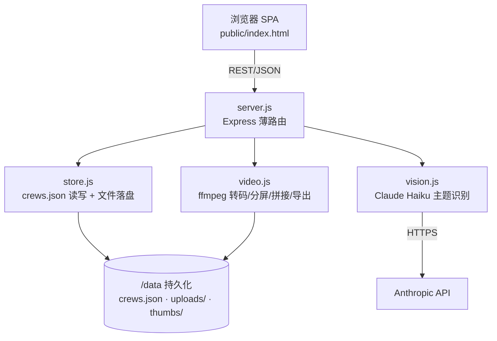
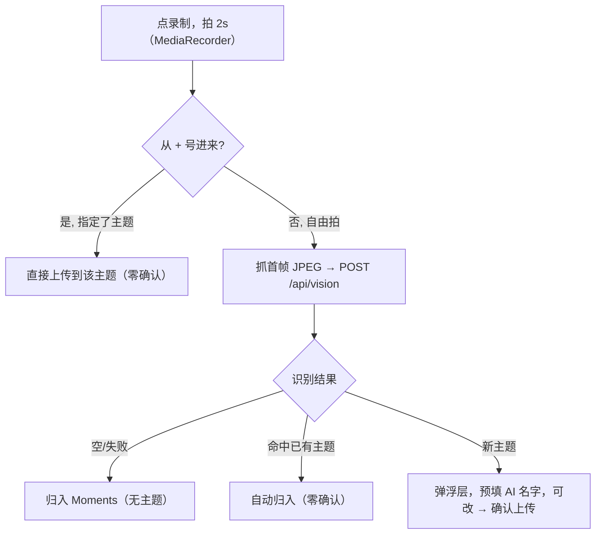
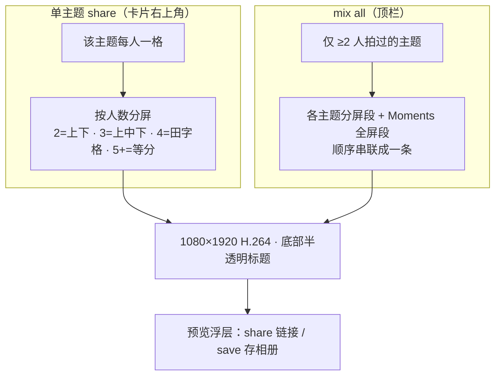

# AMINGO

> Film 2s clips with your crew — same topic, different takes — then auto-stitch them into a vertical split-screen montage.

一个轻量的「小队合拍」Web App：建一个 crew，邀请朋友，大家就同一个主题各拍一段 2 秒短视频，AI 自动识别主题归类，最后一键合成竖屏分屏成片分享。

线上地址：https://graceful-peace-production-ad5a.up.railway.app

---

## 1. 技术栈

| 层 | 技术 |
|----|------|
| 后端 | Node.js + Express 5（单进程） |
| 视频处理 | ffmpeg（系统 apt 版优先，`ffmpeg-static` 兜底） |
| AI 主题识别 | Claude Haiku 4.5（`/v1/messages` 图像识别） |
| 前端 | 单文件原生 HTML/CSS/JS（`public/index.html`，无框架、无构建步骤） |
| 存储 | 本地文件系统：`crews.json`（元数据）+ `uploads/`（视频）+ `thumbs/`（封面） |
| 部署 | Docker + Railway（带持久化 Volume 挂在 `/data`） |

无数据库、无前端构建、无前后端分离 —— 刻意做薄，便于快速迭代。

---

## 2. 架构



模块职责：

- **`server.js`** — 路由、multer 上传、参数校验、错误兜底。本身不含业务算法。
- **`store.js`** — 数据模型与持久化。内存里维护 `crews` 对象，每次变更 `save()` 全量写回 `crews.json`。
- **`vision.js`** — 一帧图 → 一个宽泛英文主题词。失败/超时/无 key 一律返回 `''`。
- **`video.js`** — 所有 ffmpeg 流水线（转码、单主题分屏、同人多条横向拼接、混剪导出）。串行锁保证同时只跑一个导出。
- **`public/index.html`** — 整个前端（onboarding、卡片滑动、相机录制、主题确认、成片预览）。

---

## 3. 核心流程

### 3.1 拍摄 → 主题归类



- AI 偏好**宽泛**主题词（Food / Drink / Selfie / Outdoor / Work …），不限固定词表。
- 识别不出 → 归 **Moments**（成片里作为全屏单独段）。

### 3.2 同一个人同一主题：横向拼接

- 一个人对同一主题最多保留 **3 条**，超出删最旧。
- ≥2 条时后端用 ffmpeg `hstack` **横向并排**成一条（`stitches` 里索引），卡片格子和成片导出都用这条。

### 3.3 成片导出（share / mix）



- 输出固定 **1080×1920**，每段 2s。
- **按人数分屏**（不是按 clip 数）；一个人的多条已先拼成一格。
- 标题用 `drawtext` 叠在底部（需 ffmpeg 含 drawtext + 字体文件，二者缺一则跳过标题不报错）。

---

## 4. 数据与存储

无数据库。所有状态在 `crews.json`，视频/封面在文件系统。

存储根目录 `DATA_DIR`：**`/data` 存在则用它**（Railway Volume，持久化），否则用项目根目录（本地开发）。

```
DATA_DIR/
├── crews.json          # 所有 crew 元数据
├── uploads/            # 视频：原始 clip、拼接(stitch)、导出(export)
└── thumbs/             # 首帧封面 jpg（仅作 <video> poster）
```

`crews.json` 结构：

```json
{
  "<crewId>": {
    "id": "<crewId>",
    "members": [{ "id": "<memberId>", "name": "Alice" }],
    "clips": [
      { "id": "...", "memberId": "...", "memberName": "Alice",
        "file": "<crewId>_xxxx.mp4", "thumb": "<crewId>_xxxx.jpg",
        "category": "Drink", "ts": 1781770000000 }
    ],
    "nudges": [{ "fromId": "...", "fromName": "Alice", "category": "Drink", "ts": 0 }],
    "stitches": { "<memberId>|drink": "<crewId>_stitch_<memberId>_drink_xx.mp4" }
  }
}
```

文件命名（均唯一不可变，便于长缓存）：

| 类型 | 命名 |
|------|------|
| 原始 clip | `{crewId}_{rand}.mp4` |
| 横向拼接 | `{crewId}_stitch_{memberId}_{catKey}_{rand}.mp4` |
| 导出成片 | `{crewId}_export_{timestamp}.mp4`（每 crew 保留最近 12 个） |

> `catKey` = 主题名小写去非字母数字，用于「同人同主题」分组（见 `store.catKey`）。

---

## 5. HTTP API

| 方法 | 路径 | 说明 |
|------|------|------|
| POST | `/api/crew` | 建 crew。body `{name}` → `{crewId, memberId, joinUrl}` |
| POST | `/api/crew/:id/join` | 加入 crew。body `{name}` → `{crewId, memberId, members}` |
| GET | `/api/crew/:id` | 拉 crew 全量：`{members, clips[], stitches, nudges[]}` |
| POST | `/api/crew/:crewId/clip` | 上传 clip（multipart：`clip` 视频 + `memberId` + `thumb` dataURL + `category`） |
| POST | `/api/vision` | 主题识别。body `{image: dataURL}` → `{label}` |
| POST | `/api/crew/:crewId/export` | 导出成片。body `{category?}`（无则 mix all）→ `{videoUrl}` |
| POST | `/api/crew/:crewId/nudge` | 戳一下队友。body `{memberId, category}` |
| GET | `/api/crew/:crewId/nudges?since=ts` | 拉新 nudge |
| GET | `/api/crew/:crewId/download/:clipId` | 下载单条 clip |
| GET | `/api/admin/crews` | 所有 crew 概览（运维用） |
| GET | `/join/:crewId` | 返回 SPA（邀请链接入口） |

---

## 6. 本地运行

前置：Node 18+；本机最好装 `ffmpeg`（没有则自动用 `ffmpeg-static`，但 linux 静态版**不含 drawtext**，标题会被跳过）。

```bash
npm install
export ANTHROPIC_API_KEY=sk-ant-...   # 不设也能跑，只是 AI 识别不工作
node server.js                        # 默认 http://localhost:3456
```

> ⚠️ 摄像头（`getUserMedia`）和系统分享只在**安全上下文**可用：`localhost` 或 HTTPS。用局域网 IP（`http://192.168.x`）在手机上**拍不了**，需走 HTTPS（线上 / 隧道）。

---

## 7. 构建与部署

容器镜像（`Dockerfile`）：`node:24-slim` + apt 装 `ffmpeg fonts-dejavu-core` → `npm install --production` → `node server.js`，监听 `PORT`（默认 3456）。

> 为什么 apt 装 ffmpeg：`ffmpeg-static` 的 linux 静态版不含 `drawtext`（标题叠加会报 "Filter not found"）；Debian apt 版含 drawtext。`video.js` 启动时自动选**含 drawtext 的可用 ffmpeg**。

部署到 **Railway**（项目 `graceful-peace`，CLI 直接推本地代码构建）：

```bash
npx @railway/cli login
npx @railway/cli link --workspace "<workspace>" --project graceful-peace
npx @railway/cli variables --set "ANTHROPIC_API_KEY=sk-ant-..."   # 必须，v2 只读环境变量
npx @railway/cli up                                                # 基于 Dockerfile 构建部署
```

部署要点：

- **环境变量** `ANTHROPIC_API_KEY` 必须设置（旧版曾硬编码 fallback，现已移除）。`PORT` 由 Railway 注入。
- **持久化 Volume** 挂在 `/data`；`crews.json`、`uploads/`、`thumbs/` 全在 Volume，重新部署不丢数据。
- GitHub 仓库：`chenpianzhou/amingo-crew`。注意 `railway up` 是直接传本地代码构建，**不依赖 GitHub push**。

---

## 8. 已知约束

- 单进程内存态 + 全量写 JSON，不适合高并发 / 多实例（横向扩展会丢数据一致性）。
- 导出 ffmpeg 用 `-threads 1 + preset ultrafast` 控内存（小实例会 OOM）。
- iOS 保存到相册走 `navigator.share({files})`（系统面板「Save Video」），需 HTTPS。
- UI 文案全英文。
